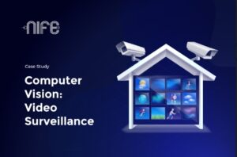
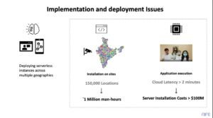

Computer Vision at Edge is a growing subject with significant advancement in the new age of surveillance. Surveillance cameras can be primary or intelligent, but Intelligent cameras are expensive. Every country has some laws associated with Video Surveillance.

_How do Video Analytics companies rightfully serve their customers, with high demand?_

**Nife helps with this.**

 

### Introduction

The need for higher bandwidth and low latency processing has continued with the on-prem servers. While on-prem servers provide low latency, they do not allow flexibility.

[Computer Vision can be used for various purposes such as Drone](/blog/computing-versus-flying-drones-edge-technology/) navigation, Wildlife monitoring, Brand value analytics, Productivity monitoring, or even Package delivery monitoring can be done with the help of these high-tech devices. The major challenge in computing on the cloud is data privacy, especially when images are analyzed and stored.

Another major challenge is spinning up the same algorithm or application in multiple locations, which means hardware needs to be deployed there. Hence scalability and flexibility are the key issues. Accordingly, Computing and Computed Analytics are hosted and stored in the cloud.

On the other hand, managing and maintaining the on-prem servers is always a challenge. The cost of the servers is high. Additionally, any device failure adds to the cost of the system integrator.

Thereby, scaling the application to host computer vision on the network edge significantly reduces the cost of the cloud while providing flexibility of the cloud.

### Key Challenges and Drivers of Computer Vision at Edge

- On-premise services
- Networking
- Flexibility
- High Bandwidth
- Low-Latency

### Solution Overview

Computer Vision requires high bandwidth and high processing, including GPUs. The Edge Cloud is critical in offering flexibility and a low price entry point of cloud hosting and, along with that, offering low latency necessary for compute-intensive applications.

Scaling the application to host on the network edge significantly reduces the camera's cost and minimizes the device capex. It can also help scale the business and comply with data privacy laws, e.g. HIPAA, GDPR, and PCI, requiring local access to the cloud.

### How does Nife Help with Computer Vision at Edge?

Use Nife to seamlessly deploy, monitor, and scale applications to as many global locations as possible in 3 simple steps. Nife works well with Computer Vision.

- Seamlessly deploy and manage navigation functionality (5 min to deploy, 3 min to scale)
  * No difference in application performance (70% improvement from Cloud)
  * Manage and Monitor all applications in a single pane of glass.
  * Update applications and know when an application is down using an interactive dashboard.
  * Reduce CapEx by using the existing infrastructure.

### A Real-Life Example of the Edge Deployment of Computer Vision and the Results

 

In the current practice, deploying the same application, which needs a low latency use case, is a challenge.

- It needs man-hours to deploy the application.
- It needs either on-prem server deployment or high-end servers on the cloud.

Nife servers are present across regions and can be used to deploy the same applications and new applications closer to the IoT cameras in Industrial Areas, Smart Cities, Schools, Offices, and in various locations. With this, you can monitor foot-fall, productivity, and other key performance metrics at lower costs and build productivity.

### Conclusion

Technology has revolutionized the world, and devices are used for almost all activities to monitor living forms. The network edge lowers latency, has reduced backhaul, and supports flexibility according to the user's choice and needs. We can attribute IoT cameras to scalability and flexibility, which are critical for the device. Hence, ensuring that mission-critical monitoring would be smarter, more accurate, and more reliable.

Want to know how you can save up on your cloud budgets? Read [this](/blog/cloud-cost-management-use-nife-to-save-cloud-budget/) blog.
